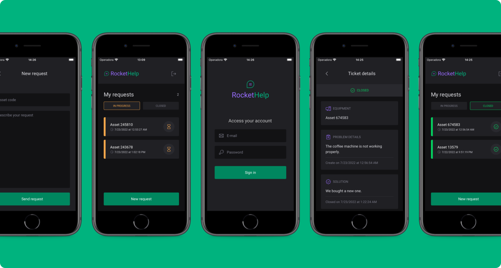

# Rocket Help mobile app - Exercise from Ignite Lab 3 React Native.

Tools:

- React Native
- TypeScript
- Expo CLI and Expo Go
- Firebase Authentication
- Firebase Firestore (database)
- Native Base (UI components library)

 

Implemented features:

- Authentication (log in)
- Listing requests
- Adding new requests
- Closing requests
- In-app navigation and input validations

 

## Project screenshot

 

 

## Extra notes

- As an exercise, this project wasn’t focused on advanced optimizations regarding data storage, processing, accessibility, scalability, cross-browser compatibility, etc. There’s still a lot to be done about it.
- As most projects, this one is not bug/error-free. If you find any bug or unexpected behavior, feel free to get in touch, here is my email - dfaferreira46@gmail.com